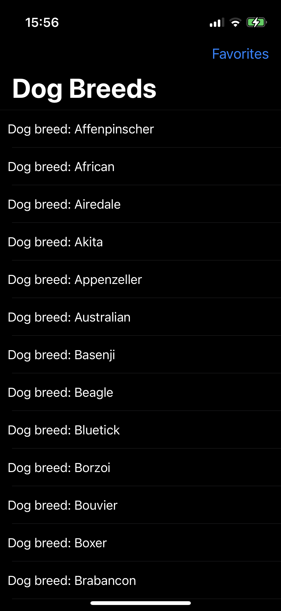

#  DogSearch  

Purpose of the project
======================

Implement a dog photo gallery application populated with data got from: (https://dog.ceo/dog-api).

When the users click on a photo, they can navigate to the detail page, with some details I have in the JSON and also able to add liked images to favorites with clicking on ⭐️ button in each cell. 

Project has an image downloader with cache support and saving that images to device disk to keep cached data permanently.

Here are the screens
======================

  &nbsp; 
    &nbsp; 
      &nbsp; 
    

## Tech-stack :calling:

* [MVVM]
* [Combine]
* [NSCache]
* [FileManager]
